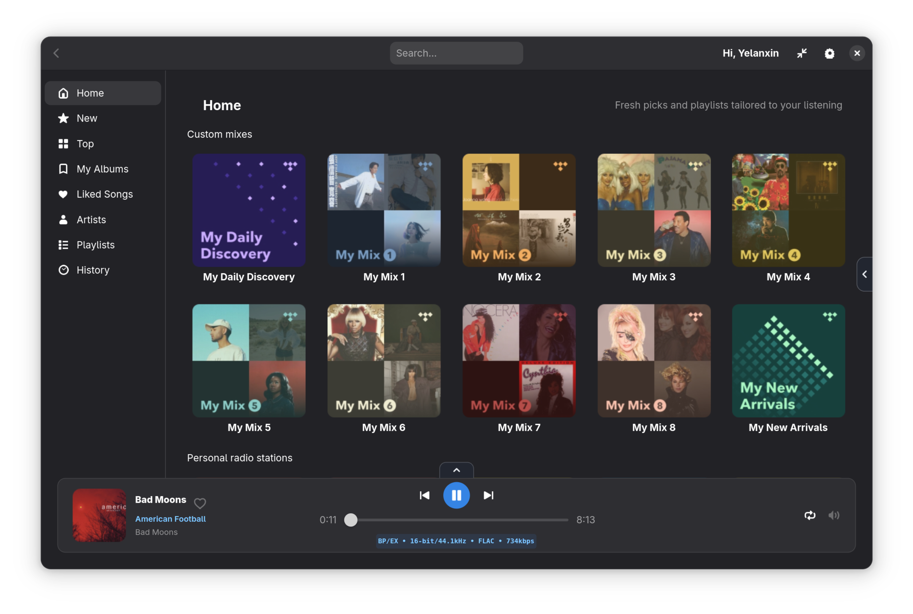
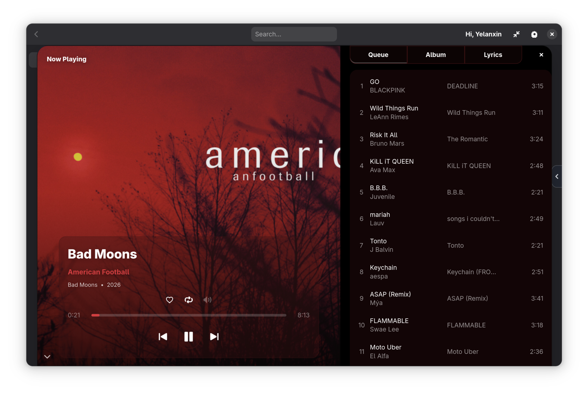
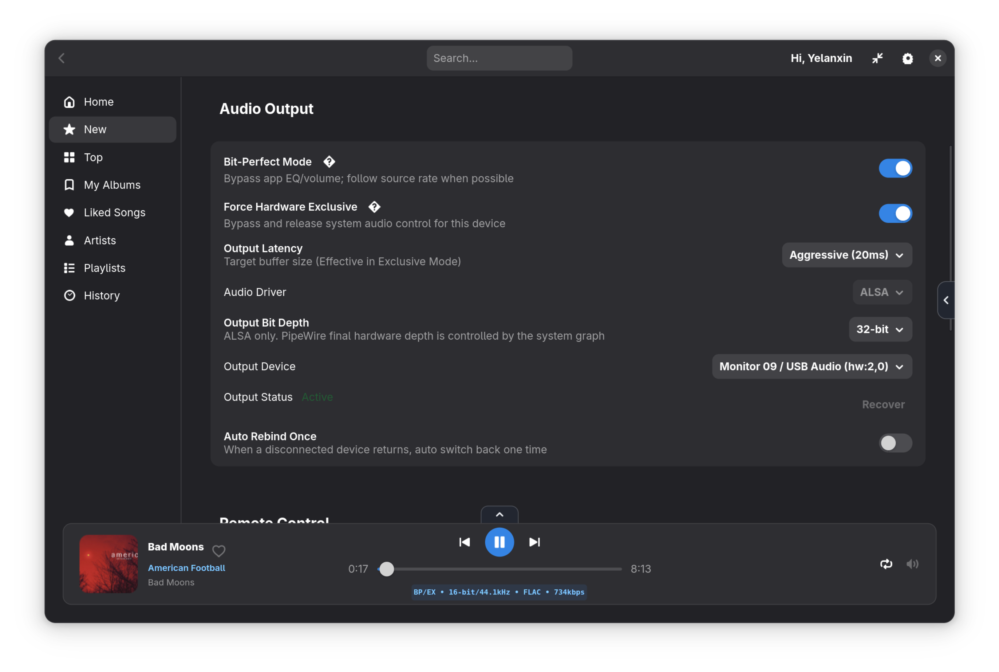

# hiresTI Music Player


`hiresTI` is a native Linux TIDAL client built for audiophiles, combining high-fidelity playback, rock-solid stability, and a modern GTK4/Libadwaita user experience.

## Highlights

- A high performance Rust audio engine core
- Native Linux UI with GTK4 + Libadwaita
- TIDAL OAuth login and account-scoped library access
- Bit-perfect playback flow with optional exclusive output controls
- Fast collection browsing (Albums, Liked Songs, Artists, Queue, History)
- Cloud playlist management with folder support and cover collage previews
- Built-in queue drawer, lyrics support, and visualizer modules
- MPRIS support (`org.mpris.MediaPlayer2.hiresti`) for desktop media controls
- Built-in remote control with HTTP JSON-RPC, MCP endpoint.

## Screenshots
### Main Window





### Mini Mode


## Tech Stack

- Python 3.10+
- GTK4 + Libadwaita (PyGObject)
- Rust audio engine core (`rust_audio_core`)
- GStreamer (audio pipeline runtime via Rust core)
- `tidalapi` (TIDAL integration)

## Audio Engine Note

Starting from `v1.2.0`, playback is driven by the Rust audio engine core by default.
Python remains the UI/application layer, while transport/output routing and core playback runtime run through Rust.

## Runtime Requirements

Install these system packages first:

- Python 3.10+
- GTK4
- Libadwaita
- GStreamer core and plugins
- PyGObject bindings

Bundled Python dependencies used by packaging:

- `tidalapi`
- `requests`
- `urllib3`
- `pystray`
- `pillow`

## Quick Start (Source)

```bash
python3 -m pip install -r requirements.txt
cargo build --manifest-path src_rust/rust_audio_core/Cargo.toml --release
cargo build --manifest-path src_rust/rust_viz_core/Cargo.toml --release
python3 src/main.py
```

`hiresTI` loads the Rust audio and visualizer cores from `src_rust/*/target/release`, so the `--release` build step is required before running from source.

## Install Prebuilt Packages
Please download prebuilt package from release page.

### Debian / Ubuntu (DEB)

```bash
sudo apt install ./hiresti_<version>_amd64.deb
```

### Fedora (RPM)

```bash
sudo dnf install ./hiresti-<version>-1.fedora.<arch>.rpm
```

### EL9 (Rocky / Alma / RHEL 9)

```bash
sudo dnf install ./hiresti-<version>-1.el9.<arch>.rpm
```

### Arch Linux

```bash
sudo pacman -U ./hiresti-<version>-1-<arch>.pkg.tar.zst
```

### Flatpak

```bash
flatpak install ./hiresti-<version>.flatpak
```

Run:

```bash
flatpak run com.hiresti.player
```

> **Note:** Requires GNOME Platform runtime 48. If not already installed:
> ```bash
> flatpak install flathub org.gnome.Platform//48 org.gnome.Sdk//48
> ```
>
> User data is stored under `~/.var/app/com.hiresti.player/`.


## Upgrade Guide

### Playlist migration note

Starting from `v1.1.0`, local playlists are removed.
Only cloud playlists are supported.

### Fedora / EL9 RPM upgrades

Use upgrade mode when moving to a newer version:

```bash
sudo dnf upgrade ./hiresti-<version>-1.fedora.<arch>.rpm
```

or:

```bash
sudo rpm -Uvh ./hiresti-<version>-1.fedora.<arch>.rpm
```

For EL9 packages, replace `fedora` with `el9`.

Do not use `rpm -i` for upgrades, because it installs side-by-side and can cause file conflict errors.

## Support

If you run into issues, have feature requests, or want to report bugs, please open a GitHub issue:

- https://github.com/yelanxin/hiresTI/issues

## Troubleshooting With Logs

If you hit a problem, please start the app from terminal and attach logs in your issue:

```bash
hiresti 2>&1 | tee /tmp/hiresti.log
```

For GTK debug output:

```bash
G_MESSAGES_DEBUG=all hiresti 2>&1 | tee /tmp/hiresti-gtk.log
```

When reporting, include:

- your distro and desktop environment
- app version
- steps to reproduce
- relevant log snippets (or the full log file path above)

## Acknowledgements

Special thanks to everyone who shares feedback. In particular, [ilijagosp](https://github.com/ilijagosp) has provided feedback and suggestions with every new release.

## License

GPL-3.0
